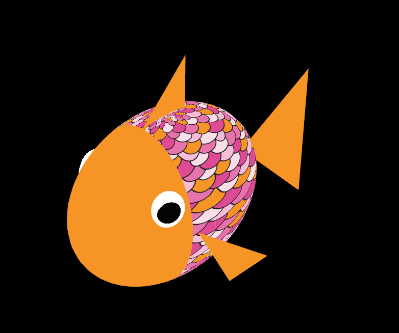
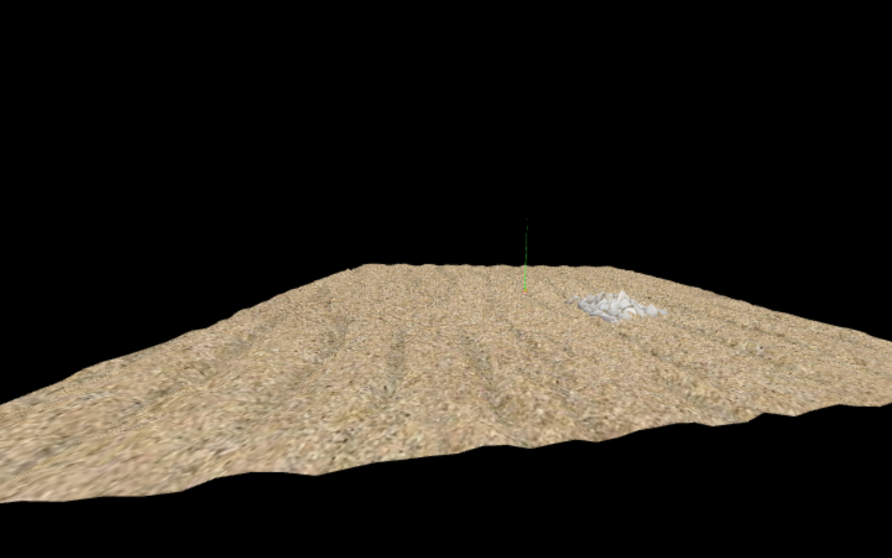

# CGRA 2020/2021

## Group T07G07
João Marinho (up201905952) & Matilde Oliveira (up201906954)

## Project Notes

The main functionalities were the ones specified in the project instructions. In addition, we added a turbo option to the fish, by pressing the space key, that boosts fish's velocity.  

In stage number **7** we decided to implement the following points:
- 7.1 Seaweed
- 7.4 Throw rocks to the target  
- 7.5 Animated fishes

## Screenshots

### 1 - MyFish

*Image 1a - Fish Appearence*

*Image 1b - Fish Appearence*

### 2 - Sea Floor

*Image 2a - Sea Floor Appearence with nest*

*Image 2b - Sea Floor Appearence with nest*

### 3 - Water Surface

*Image 3 - Water Surface Appearence*

### 4 - Rocks

*Image 4a - Rocks Display Diversity*

*Image 4b - Rocks Display Diversity*

### 5 - MyPillar

*Image 5 - Pilars of a pontoon, seen under water*

### 6 - Other Elements

*Image 6a - Underwater Diversity*

*Image 6b - Underwater Diversity*

### 7 - Control and Adicional Animations

*Image 7 - Moving Fish with its rock*

### 8 - Adicional Functionalities

*Image 8 - Final underwater preview*

*Image 8 - Fish throwing its rock*
